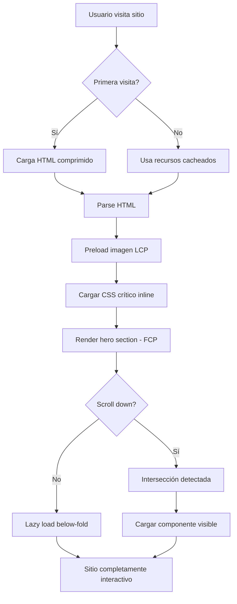

# Product Design Requirements (PDR)

## Web Performance Optimization - Core Web Vitals Enhancement

**Date**: 2025-11-21 **Status**: Draft **Priority**: P1 (High) **Owner**: qazuor
**Feature Type**: Enhancement

---

## 1. Overview

### 1.1 Problem Statement

A pesar de que el sitio tiene métricas Core Web Vitals excelentes (LCP 435ms,
CLS 0.00), se han identificado oportunidades significativas de optimización que
pueden reducir el LCP en un 31% y la cadena crítica de dependencias en un 58%.

**Context:**

- **Business context**: Un sitio más rápido mejora la experiencia del usuario,
  SEO rankings, y tasas de conversión. Google utiliza Core Web Vitals como
  factor de ranking.
- **Technical context**: Análisis de performance reveló problemas en la cadena
  de dependencias de red (960ms), falta de compresión HTML (3.4MB sin
  comprimir), y DOM grande (2,883 elementos).
- **User context**: Los usuarios esperan páginas que carguen instantáneamente.
  Cada 100ms de mejora en LCP puede aumentar conversión y engagement.

### 1.2 Goals & Success Metrics

**Primary Goal:** Optimizar la performance del sitio web reduciendo el LCP de
435ms a menos de 300ms y mejorar el tiempo de carga interactiva.

**Success Metrics:**

- **LCP (Largest Contentful Paint)**: Reducir de 435ms a < 300ms
  - How measured: Chrome DevTools Performance trace / Lighthouse
- **Cadena crítica de red**: Reducir de 960ms a < 400ms
  - How measured: Network waterfall analysis en Chrome DevTools
- **Transfer size**: Reducir de 3.4MB a < 800KB
  - How measured: Network panel en Chrome DevTools
- **FCP (First Contentful Paint)**: Reducir de ~435ms a < 250ms
  - How measured: Chrome DevTools Performance trace / Lighthouse
- **DOM Size**: Reducir elementos de 2,883 a < 2,000
  - How measured: Chrome DevTools DOM size audit

### 1.3 Non-Goals

- No vamos a migrar a un framework diferente (nos quedamos con Astro)
- No vamos a cambiar la estructura visual o diseño actual
- No vamos a implementar SSR (Server Side Rendering) en esta iteración
- No vamos a optimizar imágenes más allá del preload crítico (ya están
  optimizadas con Astro Image)
- No vamos a implementar PWA o service workers en esta fase

---

## 2. User Stories

### US-001: Carga más rápida de la página principal

**As a** visitante del sitio **I want to** ver el contenido principal de la
página en menos de 300ms **So that** tenga una experiencia instantánea y no
espere a que cargue

**Priority**: P0

**Acceptance Criteria**:

- [ ] **AC-001**: LCP debe ser menor a 300ms en dispositivos de escritorio
  - Given: Usuario visita la página principal con conexión 4G
  - When: La página comienza a cargar
  - Then: El elemento LCP (imagen hero) debe renderizarse completamente en <
    300ms

- [ ] **AC-002**: FCP debe ser menor a 250ms
  - Given: Usuario visita cualquier página del sitio
  - When: La navegación inicia
  - Then: El primer contenido visible aparece en < 250ms

- [ ] **AC-003**: La cadena crítica de dependencias no debe exceder 400ms
  - Given: Análisis de network waterfall
  - When: Se mide la cadena más larga de requests
  - Then: No debe superar 400ms desde el documento inicial

**Edge Cases:**

- Conexiones lentas (3G): Priorizar contenido crítico, lazy load el resto
- First visit vs returning visit: Cache warming para usuarios recurrentes
- Diferentes rutas: Asegurar optimizaciones en todas las páginas, no solo
  homepage

---

### US-002: Reducción del tamaño de transferencia

**As a** usuario con datos móviles limitados **I want to** consumir menos ancho
de banda al cargar el sitio **So that** no gaste mis datos innecesariamente

**Priority**: P1

**Acceptance Criteria**:

- [ ] **AC-001**: HTML debe estar comprimido con gzip/brotli
  - Given: Request al documento HTML principal
  - When: Se analiza el response header
  - Then: Debe incluir `Content-Encoding: gzip` o `Content-Encoding: br`

- [ ] **AC-002**: Total transfer size debe ser < 800KB en carga inicial
  - Given: Primera visita a la homepage
  - When: Todos los recursos críticos han cargado
  - Then: El total transferido debe ser menor a 800KB

- [ ] **AC-003**: JavaScript bundles deben usar code splitting
  - Given: Análisis de bundles generados
  - When: Se inspecciona el build output
  - Then: Debe haber bundles separados para i18n, iconos, y vendors

**Edge Cases:**

- CDN resources (Mermaid): Ya están optimizados, no contarlos en el transfer
  size local
- Fonts: Usar font-display: swap y preload solo las variantes críticas

---

### US-003: Optimización de recursos i18n e iconos

**As a** desarrollador del sitio **I want to** cargar solo los recursos
necesarios para cada página **So that** reducir el bundle inicial y mejorar
performance

**Priority**: P1

**Acceptance Criteria**:

- [ ] **AC-001**: Traducciones deben cargarse lazy
  - Given: Usuario visita una página
  - When: El componente de i18n inicializa
  - Then: Solo debe cargar el idioma activo y namespace requerido

- [ ] **AC-002**: Iconos SVG no deben cargarse síncronamente
  - Given: Componente Timeline con 26 iconos
  - When: La página renderiza
  - Then: Iconos deben usar sprite SVG o lazy loading

- [ ] **AC-003**: Components below-the-fold deben ser lazy loaded
  - Given: Secciones como Timeline, Projects, etc.
  - When: Usuario ve la página
  - Then: Solo hero y navbar deben cargarse inmediatamente

**Edge Cases:**

- Language switching: Precargar el otro idioma después del initial load
- Icon sprite cache: Usar cache-control headers apropiados

---

## 3. Design & Mockups

### 3.1 User Flow Diagram



**Description:** El flujo prioriza el contenido crítico (hero) mediante preload
de imagen LCP y CSS inline crítico. Los componentes below-the-fold (Timeline,
Projects, etc.) se cargan solo cuando el usuario hace scroll, reduciendo el
bundle inicial.

### 3.2 Performance Optimization Architecture

No hay cambios visuales en la UI. Las optimizaciones son técnicas:

**Key Elements:**

- **HTML Compression**: Activar gzip/brotli en servidor de desarrollo y
  producción
- **Preload critical resources**: `<link rel="preload">` para imagen LCP
- **Code Splitting**: Separar bundles por función (i18n, icons, vendors)
- **Lazy Loading**: Componentes below-the-fold con Intersection Observer

**Interaction Flow:**

1. Usuario navega al sitio → HTML comprimido se descarga rápido
2. Navegador parsea HTML → Encuentra preload hints para imagen hero
3. CSS crítico inline renderiza hero → FCP ocurre rápidamente
4. JavaScript bundles optimizados cargan en paralelo
5. Componentes below-fold esperan scroll para hidratar

### 3.3 Component Specifications

#### Optimización de Timeline Component

**Current State:**

- Carga síncrona de 26 iconos SVG
- Parte de cadena crítica de 960ms
- Todos los iconos cargan aunque no sean visibles

**Optimized State:**

- SVG sprite único o lazy loading
- Fuera de cadena crítica
- Solo iconos visibles cargan inicialmente

**Implementation:**

- Opción 1: SVG sprite sheet con `<use>`
- Opción 2: Dynamic imports en scroll
- Opción 3: Iconos como data URIs inline solo visibles

#### Optimización de i18n System

**Current State:**

- 8 archivos JSON cargados síncronamente (ES + EN × 4 namespaces)
- Final de cadena crítica (960ms)

**Optimized State:**

- Solo idioma activo + namespace actual
- Lazy load namespaces por ruta
- Preload del otro idioma en background

**Implementation:**

```typescript
// Lazy load por namespace
const loadNamespace = (lang: string, ns: string) =>
  import(`./locales/${lang}/${ns}.json`);

// Preload siguiente idioma después de load
requestIdleCallback(() => {
  const nextLang = currentLang === 'en' ? 'es' : 'en';
  loadNamespace(nextLang, currentNamespace);
});
```

---

## 4. Technical Constraints

### 4.1 Performance Requirements

**Page Load Time:**

- Desktop: < 1 second (target: 300ms LCP)
- Mobile: < 2 seconds (target: 500ms LCP)

**Core Web Vitals:**

- LCP: < 300ms (currently 435ms)
- FCP: < 250ms (currently ~435ms)
- CLS: Maintain 0.00 (currently perfect)
- FID/INP: < 100ms

**Network:**

- Critical path: < 400ms (currently 960ms)
- Total transfer: < 800KB (currently 3.4MB uncompressed)
- HTML compression: Required (currently none)

**Bundle Size:**

- Initial JavaScript: < 150KB
- Initial CSS: < 50KB (inline critical CSS)
- Per-route chunks: < 50KB each

**Other Performance Metrics:**

- Time to Interactive (TTI): < 1.5s
- Total Blocking Time (TBT): < 200ms
- DOM size: < 2,000 elements (currently 2,883)

### 4.2 Security Requirements

**No security changes required** - Todas las optimizaciones son client-side
performance

**Considerations:**

- Mantener CSP (Content Security Policy) existente
- No introducir XSS vulnerabilities con lazy loading dinámico
- Validar imports dinámicos para evitar code injection

### 4.3 Accessibility Requirements

**WCAG Level**: AA (mantener nivel actual)

**Required Support:**

- [x] Keyboard navigation (no changes)
- [x] Screen reader compatibility (no changes)
- [x] Focus indicators (mantener)
- [x] Color contrast (no visual changes)
- [x] ARIA labels (preservar todos)

**Critical**: Lazy loading NO debe romper navegación por teclado o screen
readers

**Testing Required:**

- Validar que componentes lazy loaded sean accesibles
- Asegurar que focus management funcione correctamente
- Probar con NVDA/JAWS después de optimizaciones

### 4.4 Browser/Device Support

**Desktop Browsers:**

- Chrome: 90+ (native lazy loading support)
- Firefox: 85+ (intersection observer)
- Safari: 14+ (dynamic imports)
- Edge: 90+

**Mobile Devices:**

- iOS: 14+
- Android: Chrome 90+

**Required Features:**

- Native lazy loading (`loading="lazy"`)
- Dynamic imports (`import()`)
- Intersection Observer API
- Brotli compression support

---

## 5. Dependencies & Integrations

### 5.1 Internal Dependencies

| Package/Service | Version | Why Needed                                  | Impact if Unavailable |
| --------------- | ------- | ------------------------------------------- | --------------------- |
| Astro           | 5.15.9  | Core framework, provides Image optimization | Cannot build site     |
| Vite            | 6.4.1   | Build tool, provides code splitting         | Cannot bundle         |
| @astrojs/react  | latest  | React integration for islands               | Islands won't hydrate |

### 5.2 External Dependencies

No hay nuevas dependencias externas. Las optimizaciones usan features nativas
del browser.

| Service/API  | Version | Why Needed      | Rate Limits | Fallback                |
| ------------ | ------- | --------------- | ----------- | ----------------------- |
| jsDelivr CDN | N/A     | Mermaid library | None        | Local bundle if offline |

### 5.3 New Dependencies

**Packages to Add:**

Ninguno. Todas las optimizaciones usan:

- Astro built-in features (code splitting, image optimization)
- Vite configuration
- Browser native APIs (Intersection Observer, dynamic imports)

**Justification:** Evitamos agregar dependencias para mantener bundle size bajo
y reducir complejidad.

---

## 6. Risks & Mitigations

| Risk                                        | Impact | Probability | Mitigation Strategy                                                 | Owner  |
| ------------------------------------------- | ------ | ----------- | ------------------------------------------------------------------- | ------ |
| Lazy loading rompe SEO                      | High   | Low         | Usar Intersection Observer con fallback, SSG mantiene HTML completo | qazuor |
| Code splitting aumenta complejidad          | Medium | Medium      | Documentar configuración, usar convenciones claras                  | qazuor |
| Cache invalida durante desarrollo           | Low    | Medium      | Configurar cache headers apropiados, usar hash en filenames         | qazuor |
| Compresión no funciona en dev               | Low    | High        | Configurar Vite middleware, advertir en documentación               | qazuor |
| Componentes lazy loaded tienen layout shift | Medium | Medium      | Reservar espacio con min-height, usar skeleton loaders              | qazuor |

**Risk Details:**

### Risk 1: Lazy loading rompe SEO

- **Description**: Los crawlers podrían no ejecutar JavaScript y perder
  contenido lazy loaded
- **Impact if occurs**: Pérdida de SEO rankings, contenido no indexado
- **Mitigation**:
  - Astro usa SSG, todo el HTML se genera en build time
  - Lazy loading solo afecta hidratación de React components
  - Content está en HTML, solo interactividad se lazy loads
- **Monitoring**: Google Search Console para verificar indexación

### Risk 2: Code splitting aumenta requests HTTP/2

- **Description**: Más archivos pequeños podrían aumentar overhead
- **Impact if occurs**: Posible degradación de performance en HTTP/1.1
- **Mitigation**:
  - HTTP/2 multiplexing maneja múltiples requests eficientemente
  - Agrupar chunks relacionados (i18n juntos, iconos juntos)
  - Mantener < 10 chunks para initial load
- **Monitoring**: Network waterfall analysis

---

## 7. Out of Scope / Future Work

**Explicitly Out of Scope:**

- Implementación de PWA / Service Workers - Considerarlo en Q1 2026
- Migración a Astro SSR - No necesario para sitio estático
- Implementación de Edge Functions - Overkill para sitio personal
- Optimización de imágenes más allá de preload - Ya optimizadas con Astro Image
- Lazy loading de fonts - Ya optimizadas con font-display: swap

**Future Enhancements:**

- HTTP/3 support cuando Vercel lo soporte nativamente
- Resource hints (prefetch/preconnect) para navegación predictiva
- Implementar route-based prefetching en hover
- Service Worker para offline support (cuando sea necesario)

**Technical Debt Created:**

- Configuración de code splitting requerirá mantenimiento cuando se agreguen
  nuevos namespaces i18n
- SVG sprite system necesitará actualización manual cuando se agreguen iconos

---

## 8. Testing Strategy

### 8.1 Test Coverage Requirements

- Unit tests: No aplica (optimizaciones de build)
- Integration tests: Validar chunks generados correctamente
- E2E tests: Lighthouse CI en cada deploy
- Performance tests: Chrome DevTools automated

### 8.2 Test Scenarios

**Build Tests:**

- Verificar que bundles se generen con code splitting correcto
- Validar que HTML incluya preload hints
- Confirmar compresión gzip/brotli en output

**Integration Tests:**

- Lazy loading funciona en scroll
- Dynamic imports cargan correctamente
- Fallbacks funcionan si JavaScript falla

**E2E Tests:**

- LCP < 300ms en Lighthouse CI
- FCP < 250ms en Lighthouse CI
- CLS mantiene 0.00
- Network waterfall no excede 400ms critical path

### 8.3 Performance Testing

**Lighthouse CI:**

- Threshold: LCP < 300ms, FCP < 250ms, CLS = 0
- Run on: Every PR, Every deploy to production
- Environments: Desktop + Mobile simulation

**Chrome DevTools:**

- CPU throttling: 4x slowdown
- Network throttling: Fast 3G
- Target: LCP < 500ms en condiciones throttled

**Real User Monitoring (Future):**

- Considerar Web Vitals library para RUM después del launch

---

## 9. Documentation Requirements

**Documentation to Create/Update:**

- [x] PDR (este documento)
- [ ] Technical Analysis (tech-analysis.md) - Detalles de implementación
- [ ] TODOs (TODOs.md) - Task breakdown
- [ ] Vite configuration guide - Explicar code splitting config
- [ ] Performance optimization guide - Best practices para futuras features
- [ ] Deployment checklist - Verificaciones pre-deploy

---

## 10. Deployment Plan

**Deployment Type**: Phased Rollout

**Rollout Plan:**

1. **Phase 1 - Development (Week 1)**:
   - Implementar code splitting
   - Configurar compresión
   - Agregar preload hints

2. **Phase 2 - Staging Testing (Week 1)**:
   - Deploy a preview environment
   - Run Lighthouse CI
   - Validar métricas

3. **Phase 3 - Production (Week 2)**:
   - Deploy a producción con monitoring
   - Comparar métricas before/after
   - Rollback si métricas empeoran

**Rollback Plan:**

- **Trigger**: LCP > 500ms O cualquier Core Web Vital empeora > 20%
- **Steps**:
  1. Revert último commit con optimizaciones
  2. Clear Vercel build cache
  3. Redeploy versión anterior
- **Data**: No hay datos de usuario afectados (optimizaciones client-side)

**Feature Flags:**

No se requieren feature flags para esta optimización.

---

## 11. Related Documents

**Planning Documents:**

- [Technical Analysis](./tech-analysis.md) - Pendiente de creación
- [TODOs & Progress](./TODOs.md) - Pendiente de creación

**Design Documents:**

- No aplica (optimizaciones técnicas sin cambios visuales)

**Technical Documents:**

- [Vite Code Splitting Docs](https://vitejs.dev/guide/build.html#chunking-strategy)
- [Astro Image Optimization](https://docs.astro.build/en/guides/images/)
- [Web.dev Performance Patterns](https://web.dev/patterns/web-vitals-patterns)

**External References:**

- [Chrome Performance Insights](https://developer.chrome.com/docs/performance/insights/)
- [Core Web Vitals Guide](https://web.dev/vitals/)
- [Optimize LCP](https://web.dev/optimize-lcp/)

---

## 12. Stakeholder Sign-Off

| Role          | Name   | Status  | Date | Comments                 |
| ------------- | ------ | ------- | ---- | ------------------------ |
| Product Owner | qazuor | Pending | -    | Awaiting review          |
| Tech Lead     | qazuor | Pending | -    | Self-review needed       |
| UX Designer   | -      | N/A     | -    | No visual changes        |
| Security      | -      | N/A     | -    | No security implications |

---

## 13. Changelog

| Date       | Author      | Changes                                    | Version |
| ---------- | ----------- | ------------------------------------------ | ------- |
| 2025-11-21 | Claude (AI) | Initial draft based on Lighthouse analysis | 0.1     |

---

## 14. Questions & Answers

**Q1**: ¿Deberíamos implementar Service Worker para caching más agresivo?
**A1**: No en esta fase. SSG + HTTP caching es suficiente. Service Worker para
v2. - 2025-11-21 - qazuor (pending)

**Q2**: ¿Qué hacemos con Mermaid desde CDN? **A2**: Mantenerlo. Ya está
optimizado y solo carga en dev toolbar. - 2025-11-21 - Claude

**Q3**: ¿Debemos optimizar todas las páginas o solo homepage? **A3**: Todas las
páginas deben beneficiarse del code splitting y compresión. - 2025-11-21 -
Claude

---

## Notes

**General Notes:**

Este PDR se basa en un análisis real de performance usando Chrome DevTools
Performance Insights. Las métricas actuales son excelentes (LCP 435ms, CLS 0.00)
pero hay oportunidades claras de mejora.

**Análisis Key Findings:**

- **LCP Breakdown**: 50.4% del tiempo es TTFB (excelente), 29.9% es render delay
  (mejorable)
- **Network Dependency Tree**: Cadena crítica de 960ms con 8 niveles de
  profundidad
- **Bundle Analysis**: 26 iconos SVG + 8 JSON i18n cargan síncronamente
- **Compresión**: HTML sin comprimir (3.4MB) es el quick win más fácil

**Meeting Notes:**

- 2025-11-21: Análisis inicial con Chrome DevTools completado
- 2025-11-21: Identificadas 3 optimizaciones high-priority

---

**Status**: Este PDR está en **Draft** - Pendiente de aprobación de qazuor

**Next Actions**:

1. Revisar y aprobar PDR
2. Crear tech-analysis.md con detalles de implementación
3. Crear TODOs.md con task breakdown

**Owner**: qazuor
