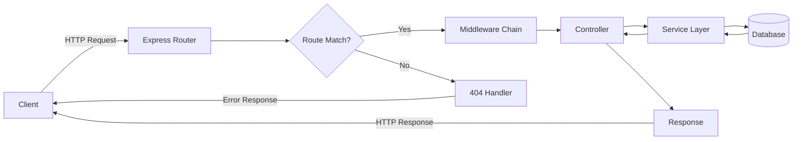

## Introduction to REST APIs

RESTful APIs are the backbone of modern web applications. Let's build a complete
API from scratch using Node.js and Express.

### API Request Flow



## Setting Up the Project

First, initialize your Node.js project:

```bash
mkdir my-api
cd my-api
npm init -y
npm install express cors helmet morgan dotenv
npm install --save-dev nodemon
```

## Basic Express Server

Create the main server file:

```javascript
// server.js
const express = require('express');
const cors = require('cors');
const helmet = require('helmet');
const morgan = require('morgan');
require('dotenv').config();

const app = express();
const PORT = process.env.PORT || 3000;

// Middleware
app.use(helmet());
app.use(cors());
app.use(morgan('dev'));
app.use(express.json());
app.use(express.urlencoded({ extended: true }));

// Routes
app.get('/api/health', (req, res) => {
  res.status(200).json({
    status: 'OK',
    timestamp: new Date().toISOString(),
  });
});

// Error handling middleware
app.use((err, req, res, next) => {
  console.error(err.stack);
  res.status(500).json({
    error: 'Something went wrong!',
    message: err.message,
  });
});

app.listen(PORT, () => {
  console.log(`Server running on port ${PORT}`);
});
```

## Creating a Resource Controller

Let's create a users controller:

```javascript
// controllers/userController.js
const users = [];
let nextId = 1;

exports.getAllUsers = (req, res) => {
  res.status(200).json({
    success: true,
    count: users.length,
    data: users,
  });
};

exports.getUserById = (req, res) => {
  const user = users.find((u) => u.id === parseInt(req.params.id));

  if (!user) {
    return res.status(404).json({
      success: false,
      error: 'User not found',
    });
  }

  res.status(200).json({
    success: true,
    data: user,
  });
};

exports.createUser = (req, res) => {
  const { name, email } = req.body;

  if (!name || !email) {
    return res.status(400).json({
      success: false,
      error: 'Please provide name and email',
    });
  }

  const newUser = {
    id: nextId++,
    name,
    email,
    createdAt: new Date().toISOString(),
  };

  users.push(newUser);

  res.status(201).json({
    success: true,
    data: newUser,
  });
};

exports.updateUser = (req, res) => {
  const user = users.find((u) => u.id === parseInt(req.params.id));

  if (!user) {
    return res.status(404).json({
      success: false,
      error: 'User not found',
    });
  }

  const { name, email } = req.body;
  if (name) user.name = name;
  if (email) user.email = email;
  user.updatedAt = new Date().toISOString();

  res.status(200).json({
    success: true,
    data: user,
  });
};

exports.deleteUser = (req, res) => {
  const index = users.findIndex((u) => u.id === parseInt(req.params.id));

  if (index === -1) {
    return res.status(404).json({
      success: false,
      error: 'User not found',
    });
  }

  users.splice(index, 1);

  res.status(204).send();
};
```

## Defining Routes

```javascript
// routes/userRoutes.js
const express = require('express');
const router = express.Router();
const {
  getAllUsers,
  getUserById,
  createUser,
  updateUser,
  deleteUser,
} = require('../controllers/userController');

router.route('/').get(getAllUsers).post(createUser);

router.route('/:id').get(getUserById).put(updateUser).delete(deleteUser);

module.exports = router;
```

## Conclusion

You now have a fully functional REST API with CRUD operations. In the next
article, we'll add database integration with MongoDB!
