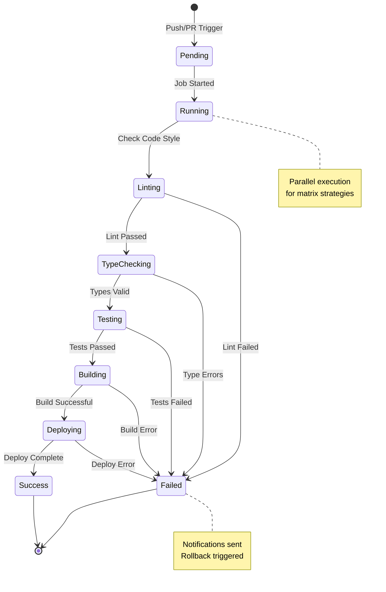

## Pipeline State Flow



## Basic Workflow Structure

GitHub Actions workflows are defined in YAML files in the `.github/workflows`
directory.

```yaml
name: CI/CD Pipeline

on:
  push:
    branches: [main, develop]
  pull_request:
    branches: [main]
  workflow_dispatch: # Manual trigger

env:
  NODE_VERSION: '20.x'
  PNPM_VERSION: '8'

jobs:
  test:
    name: Run Tests
    runs-on: ubuntu-latest

    steps:
      - name: Checkout code
        uses: actions/checkout@v4
        with:
          fetch-depth: 0 # Full history for better analysis

      - name: Setup Node.js
        uses: actions/setup-node@v4
        with:
          node-version: ${{ env.NODE_VERSION }}

      - name: Setup pnpm
        uses: pnpm/action-setup@v2
        with:
          version: ${{ env.PNPM_VERSION }}

      - name: Get pnpm store directory
        id: pnpm-cache
        run: echo "pnpm_cache_dir=$(pnpm store path)" >> $GITHUB_OUTPUT

      - name: Setup pnpm cache
        uses: actions/cache@v4
        with:
          path: ${{ steps.pnpm-cache.outputs.pnpm_cache_dir }}
          key: ${{ runner.os }}-pnpm-store-${{ hashFiles('**/pnpm-lock.yaml') }}
          restore-keys: |
            ${{ runner.os }}-pnpm-store-

      - name: Install dependencies
        run: pnpm install --frozen-lockfile

      - name: Run linter
        run: pnpm lint

      - name: Run type check
        run: pnpm typecheck

      - name: Run tests
        run: pnpm test:coverage

      - name: Upload coverage reports
        uses: codecov/codecov-action@v4
        with:
          token: ${{ secrets.CODECOV_TOKEN }}
          files: ./coverage/coverage-final.json
          flags: unittests
```

## Matrix Strategy for Multiple Versions

```yaml
name: Cross-Platform Testing

on: [push, pull_request]

jobs:
  test:
    name: Test on ${{ matrix.os }} with Node ${{ matrix.node }}
    runs-on: ${{ matrix.os }}

    strategy:
      fail-fast: false
      matrix:
        os: [ubuntu-latest, windows-latest, macos-latest]
        node: [18, 20, 21]
        exclude:
          # Exclude certain combinations if needed
          - os: windows-latest
            node: 18

    steps:
      - uses: actions/checkout@v4

      - name: Setup Node.js ${{ matrix.node }}
        uses: actions/setup-node@v4
        with:
          node-version: ${{ matrix.node }}

      - name: Install dependencies
        run: npm ci

      - name: Run tests
        run: npm test
```

## Docker Build and Push

```yaml
name: Docker Build & Push

on:
  push:
    branches: [main]
    tags: ['v*']

env:
  REGISTRY: ghcr.io
  IMAGE_NAME: ${{ github.repository }}

jobs:
  build-and-push:
    name: Build and Push Docker Image
    runs-on: ubuntu-latest
    permissions:
      contents: read
      packages: write

    steps:
      - name: Checkout
        uses: actions/checkout@v4

      - name: Set up QEMU
        uses: docker/setup-qemu-action@v3

      - name: Set up Docker Buildx
        uses: docker/setup-buildx-action@v3

      - name: Log in to Container Registry
        uses: docker/login-action@v3
        with:
          registry: ${{ env.REGISTRY }}
          username: ${{ github.actor }}
          password: ${{ secrets.GITHUB_TOKEN }}

      - name: Extract metadata
        id: meta
        uses: docker/metadata-action@v5
        with:
          images: ${{ env.REGISTRY }}/${{ env.IMAGE_NAME }}
          tags: |
            type=ref,event=branch
            type=ref,event=pr
            type=semver,pattern={{version}}
            type=semver,pattern={{major}}.{{minor}}
            type=sha,prefix={{branch}}-

      - name: Build and push
        uses: docker/build-push-action@v5
        with:
          context: .
          platforms: linux/amd64,linux/arm64
          push: true
          tags: ${{ steps.meta.outputs.tags }}
          labels: ${{ steps.meta.outputs.labels }}
          cache-from: type=gha
          cache-to: type=gha,mode=max
```

## Deploy to Vercel

```yaml
name: Deploy to Vercel

on:
  push:
    branches: [main]

jobs:
  deploy:
    name: Deploy to Production
    runs-on: ubuntu-latest
    environment:
      name: production
      url: https://myapp.vercel.app

    steps:
      - uses: actions/checkout@v4

      - name: Setup Node.js
        uses: actions/setup-node@v4
        with:
          node-version: '20'

      - name: Install Vercel CLI
        run: npm install --global vercel@latest

      - name: Pull Vercel Environment
        run:
          vercel pull --yes --environment=production --token=${{
          secrets.VERCEL_TOKEN }}

      - name: Build Project
        run: vercel build --prod --token=${{ secrets.VERCEL_TOKEN }}

      - name: Deploy to Vercel
        id: deploy
        run: |
          url=$(vercel deploy --prebuilt --prod --token=${{ secrets.VERCEL_TOKEN }})
          echo "url=$url" >> $GITHUB_OUTPUT

      - name: Comment PR
        if: github.event_name == 'pull_request'
        uses: actions/github-script@v7
        with:
          script: |
            github.rest.issues.createComment({
              issue_number: context.issue.number,
              owner: context.repo.owner,
              repo: context.repo.repo,
              body: '✅ Deployed to: ${{ steps.deploy.outputs.url }}'
            })
```

## Semantic Release

```yaml
name: Release

on:
  push:
    branches: [main]

jobs:
  release:
    name: Semantic Release
    runs-on: ubuntu-latest
    permissions:
      contents: write
      issues: write
      pull-requests: write

    steps:
      - name: Checkout
        uses: actions/checkout@v4
        with:
          fetch-depth: 0
          persist-credentials: false

      - name: Setup Node.js
        uses: actions/setup-node@v4
        with:
          node-version: '20'

      - name: Install dependencies
        run: npm ci

      - name: Run tests
        run: npm test

      - name: Semantic Release
        env:
          GITHUB_TOKEN: ${{ secrets.GITHUB_TOKEN }}
          NPM_TOKEN: ${{ secrets.NPM_TOKEN }}
        run: npx semantic-release
```

## Monorepo with Affected Detection

```yaml
name: Monorepo CI

on: [push, pull_request]

jobs:
  detect-changes:
    name: Detect Changed Projects
    runs-on: ubuntu-latest
    outputs:
      api: ${{ steps.filter.outputs.api }}
      web: ${{ steps.filter.outputs.web }}
      admin: ${{ steps.filter.outputs.admin }}

    steps:
      - uses: actions/checkout@v4

      - uses: dorny/paths-filter@v3
        id: filter
        with:
          filters: |
            api:
              - 'apps/api/**'
              - 'packages/**'
            web:
              - 'apps/web/**'
              - 'packages/**'
            admin:
              - 'apps/admin/**'
              - 'packages/**'

  test-api:
    name: Test API
    needs: detect-changes
    if: needs.detect-changes.outputs.api == 'true'
    runs-on: ubuntu-latest
    steps:
      - uses: actions/checkout@v4
      - run: pnpm install
      - run: pnpm --filter=api test

  test-web:
    name: Test Web
    needs: detect-changes
    if: needs.detect-changes.outputs.web == 'true'
    runs-on: ubuntu-latest
    steps:
      - uses: actions/checkout@v4
      - run: pnpm install
      - run: pnpm --filter=web test

  test-admin:
    name: Test Admin
    needs: detect-changes
    if: needs.detect-changes.outputs.admin == 'true'
    runs-on: ubuntu-latest
    steps:
      - uses: actions/checkout@v4
      - run: pnpm install
      - run: pnpm --filter=admin test
```

## Dependency Updates with Dependabot

```yaml
# .github/dependabot.yml
version: 2
updates:
  - package-ecosystem: 'npm'
    directory: '/'
    schedule:
      interval: 'weekly'
      day: 'monday'
      time: '09:00'
    open-pull-requests-limit: 10
    reviewers:
      - 'team-leads'
    assignees:
      - 'dependabot-reviewer'
    commit-message:
      prefix: 'chore'
      include: 'scope'
    labels:
      - 'dependencies'
      - 'automated'
```

## Conclusion

GitHub Actions provides a powerful platform for automating your CI/CD workflows.
Proper pipeline design ensures code quality and reliable deployments!
