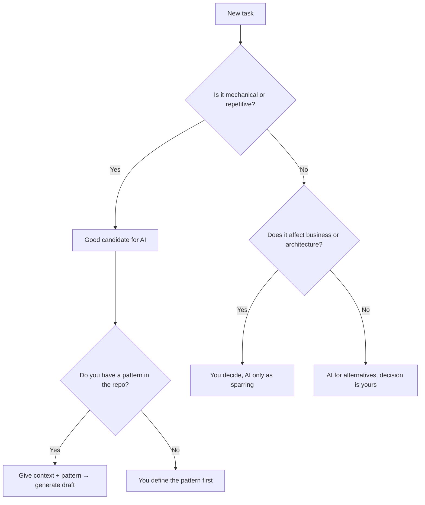
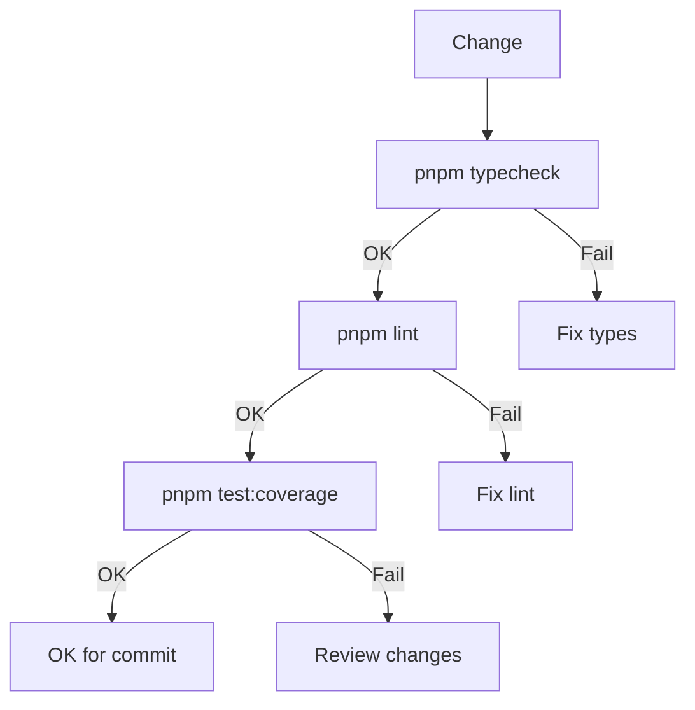

---
title:
  'How I use Claude Code and ChatGPT to accelerate my work without losing
  control of the code'
lang: en
excerpt:
  'AI as copilot, not as suicide pilot: how I integrate Claude Code and ChatGPT
  into my workflow without handing them the wheel.'
publishDate: 2025-11-16
tags: [ai, productivity, typescript, development, tools]
readTime: 12 min read
draft: false
category: productivity
image: ./_images/portfolio-design.jpg
series:
  id: ia-and-development
  name: 'AI for Development'
  part: 1
---

I use **Claude Code** and **ChatGPT** every day. They speed me up a lot, but
with a rule I don't negotiate: **they speed up, they don't decide**.

The metaphor I use is simple: _AI as copilot, not as suicide pilot_. They
propose, I dispose. If something explodes in production, I'm the one who faces
it — not the model.

In this post I share the **general framework**: what place these tools have in
my flow, what things I delegate to them, what things I won't let go no matter
what, and how I control the quality of what they generate. In
[Part 2](/en/blog/ia-codigo-calidad) I bring all this down to concrete examples
with real prompts.

---

## The mental model: proposal → review → repo


Some principles I follow:

- AI **doesn't have the complete context** of the business or project history.
- **Technical responsibility is yours**, not the model's.
- AI is strong in **speed and repetition**, weak in **judgment and context**.
- If something breaks, you're the one who answers.

I have this explicit in my `CLAUDE.md` file (the configuration that Claude Code
reads on startup):

```markdown
**Operating Principle:** You do NOT make autonomous architectural or product
decisions. You analyze, present options with tradeoffs, and wait for user
approval.
```

As long as you keep this clear, AI is just another tool in your _stack_ — not
the center of the universe.

---

## What things I DO delegate



### Repetitive boilerplate

Everything that smells like **mechanical repetition** goes straight to AI. In my
[Hospeda](/en/projects/hospeda) project, typical examples:

- _Zod schemas_ from existing types
- _Services_ that extend `BaseCrudService`
- _Routes_ that always follow the same _factory pattern_
- Permission files with the same structure

Example prompt to generate permissions:

````text
I have this permission pattern in the project:

```ts
export function checkCanCreate(actor: Actor, _data: unknown): void {
  if (
    !actor ||
    !actor.id ||
    !actor.permissions.includes(PermissionEnum.ACCOMMODATION_LISTING_CREATE)
  ) {
    throw new ServiceError(
      ServiceErrorCode.FORBIDDEN,
      'Permission denied: Insufficient permissions to create'
    );
  }
}
```

Create the complete permissions file for the `TouristService` entity
with the 11 standard functions (create, update, patch, delete, softDelete,
hardDelete, restore, view, list, search, count).

Use `PermissionEnum.TOURIST_SERVICE_*` for each one.
````

AI generates the complete file in seconds. I review that it follows the
_pattern_ and done.

### Routes with factory pattern

When you have a clear route pattern (for example, in Hono with _factories_), AI
is ideal for cloning that scheme without manual copy/paste.

```ts
// Existing pattern
export const accommodationListRoute = createListRoute({
  method: 'get',
  path: '/',
  summary: 'List accommodations',
  tags: ['Accommodations'],
  requestQuery: AccommodationSearchHttpSchema.shape,
  responseSchema: AccommodationWithBasicRelationsSchema,
  handler: async (ctx, _params, _body, query) => {
    const actor = getActorFromContext(ctx);
    const result = await accommodationService.list(actor, query || {});
    // ...
  },
  options: { skipAuth: true, cacheTTL: 60 },
});
```

Prompt: _"Create a similar route for `GET /featured-accommodations` using
`FeaturedAccommodationService.list()`. Keep the import style."_

### Mechanical refactors

Things like "change all imports from X to Y" or "unify function names" are
perfect for Claude Code:

```text
In this file I want:
- Change all imports from `@repo/db/schema/*` to `@repo/db`
- Keep the same symbol names
- Don't touch anything else

Show me the result as diff.
```

The key: be explicit and see the _diff_ before accepting.

### Documentation and auxiliary texts

AI is very good for drafts of:

- README for new _packages_
- Internal docs ("how to use this service")
- Technical descriptions for _issues_
- Parts of technical posts

Then you correct examples and details to match your real code.

### Exploring alternatives

When you're designing something new, AI is good _sparring_:

```text
I have a monorepo with apps/api (Hono), packages/service-core, packages/db (Drizzle).

I want to add a notification system that:
- Fires from the services
- Supports email, push, in-app
- Doesn't couple services to providers

Propose 2-3 possible designs with pros and cons.
```

You don't copy and paste what comes out. You use it as material to think faster.

---

## What things I DON'T delegate

### Architecture decisions

Here AI can opine, but doesn't decide:

- Database design
- _Package_ structure
- Architecture patterns
- Adding or changing technologies

I have this in my configuration:

```markdown
**NEVER decide autonomously on:**

- Architecture changes
- Major refactoring
- Technology choices
- Breaking changes
```

AI can suggest options, but the signature is yours.

### Business logic

If the logic has impact on how the platform works or on money, I think through
it myself. Examples in [Hospeda](/en/projects/hospeda):

- How _listing_ prices are calculated
- What each role can do
- Publication states (draft → published → archived)

AI helps me express that in code, but I define the rules.

### Security and permissions

I don't let go of:

- Permission system
- _Auth_ validations
- Anything that could expose data

AI can generate the _boilerplate_, but you choose the _enums_ and you define the
business rules.

---

## How I control quality

### Nothing enters without passing through your eyes

There's no "accept suggestion and commit directly". The model:

1. Claude Code proposes a change
2. You look at the _diff_
3. If you don't understand it, it doesn't enter
4. If it breaks tests, it doesn't enter

### Quality check before committing

I use a `/quality-check` command that runs in order:



If that doesn't pass, there's no _commit_. And even less _merge_.

### Tests first, trust later

If AI touches code with existing tests, I run the tests. If they break, it's not
"I'll look at it later" — it gets fixed now or reverted.

If it touches something without tests, I ask myself:

- Should I add 1-2 tests for this?
- Does it make sense to ask AI for a test skeleton?

---

## Risks and how I manage them

### Hallucinations

AI sometimes uses functions that don't exist, calls APIs you didn't implement,
or assumes structures that aren't real.

How I mitigate it:

- I use Claude Code **inside the repo** so it reads the real code
- I ask it to cite specific files
- If something looks "too perfect but unrecognizable", I distrust

### Security and sensitive data

No way around it:

- Don't paste credentials in _prompts_
- Don't describe internal vulnerabilities
- Don't use real user data

When I need examples: _"Make up fictitious names, emails, and numbers."_

### Excessive dependency

The risk is to stop thinking and just accept suggestions. How I avoid it:

- I keep writing code by hand every day
- I use AI for mechanical and repetitive stuff
- I design the _core_ parts myself

---

## Quick checklist

1. **Is it mechanical or judgment-based?** — Mechanical → AI. Judgment → you
   decide.
2. **Did you review the diff before commit?** — If you didn't see it, it doesn't
   enter.
3. **Are there tests for what you touched?** — Run tests.
4. **Does AI invent things that don't exist?** — Magnifying glass and distrust.
5. **Is there anything sensitive in the prompt?** — If in doubt, don't paste it.
6. **Could you do this without AI?** — If not, there's a problem. AI enhances,
   doesn't replace.

---

## Closing

Claude Code and ChatGPT give you an enormous productivity _boost_, but only if
**you provide the structure**.

My approach:

- AI for _boilerplate_, mechanical refactors, docs, and exploration
- Human dev for architecture, business logic, and security
- Always review, always test

_AI as copilot, not as suicide pilot._

If you want to see how all this translates to day-to-day with concrete examples,
prompts, and code, I brought it down to earth in
[Part 2: Practical checklist for using AI without filling your repo with garbage](/en/blog/ia-codigo-calidad).

---

## References

- [Claude Code](https://docs.anthropic.com/en/docs/claude-code) — The tool I use
  to work directly on the repo
- [ChatGPT](https://chat.openai.com) — For long text, _brainstorming_, and
  examples
- [Configuring Claude Code for large monorepos](/en/blog/configurando-claude-code-para-trabajar-con-monorepos-grandes)
  — How I set up Claude Code in complex projects
