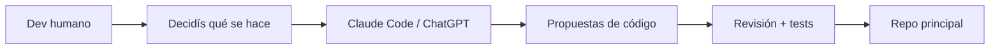
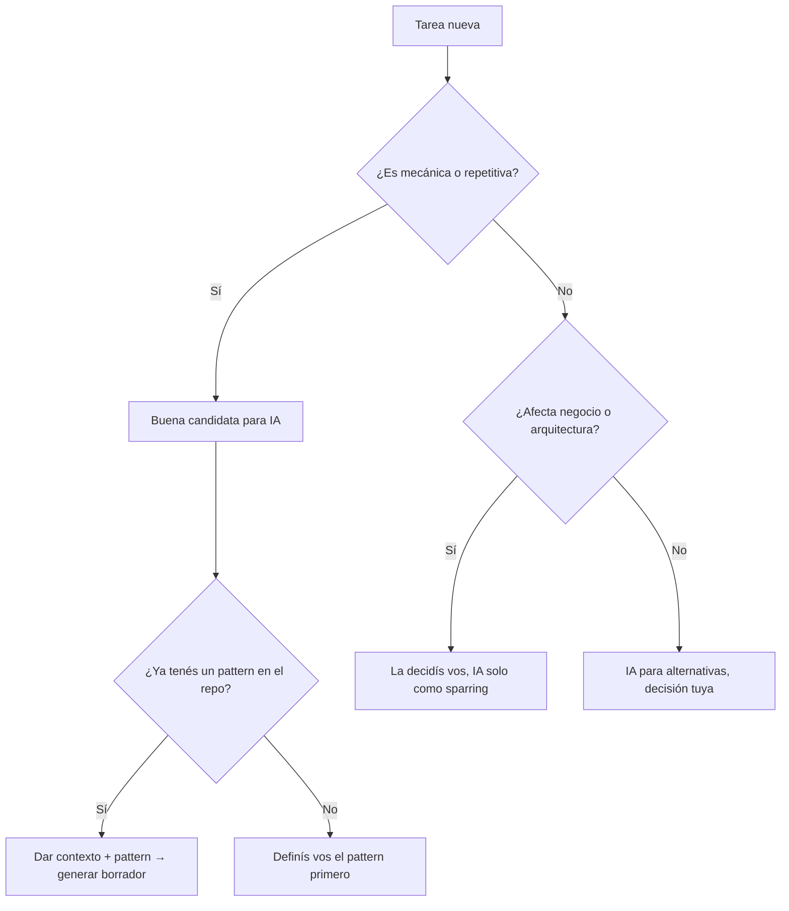
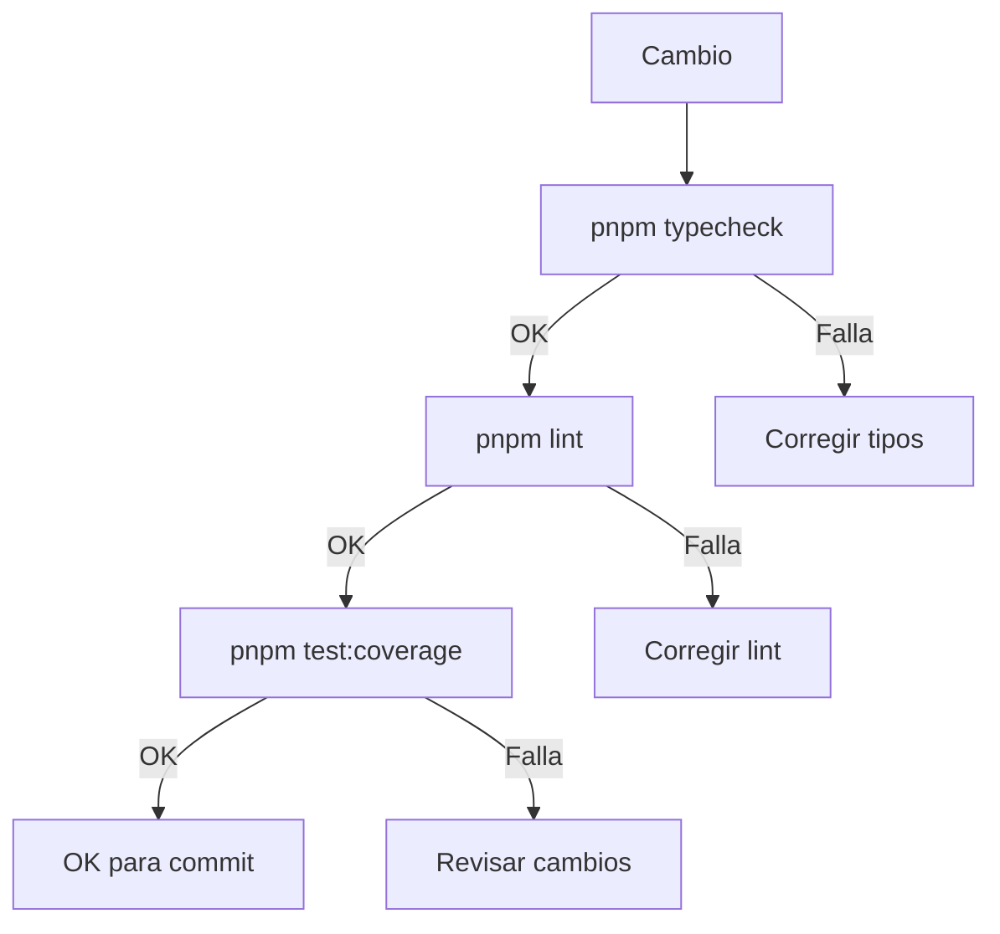

---
title:
  'Cómo uso Claude Code y ChatGPT para acelerar mi trabajo sin perder control
  del código'
slug: 'claude-code-chatgpt-productividad'
lang: es
excerpt:
  'IA como copiloto, no como piloto suicida: cómo integro Claude Code y ChatGPT
  en mi flujo de trabajo sin regalarles el volante.'
publishDate: 2025-11-16
tags: [ia, productividad, typescript, desarrollo, herramientas]
readTime: 12 min read
draft: false
category: Productividad
image: ./_images/portfolio-design.jpg
series:
  id: ia-and-development
  name: 'IA para Development'
  part: 1
---

Uso **Claude Code** y **ChatGPT** todos los días. Me aceleran un montón, pero
con una regla que no negocio: **aceleran, no deciden**.

La metáfora que uso es simple: _IA como copiloto, no como piloto suicida_. Ellos
proponen, yo dispongo. Si algo explota en producción, el que da la cara soy yo —
no el modelo.

En este post te cuento el **marco general**: qué lugar tienen estas herramientas
en mi flujo, qué cosas les delego, qué cosas no suelto ni loco, y cómo controlo
la calidad de lo que generan. En la [Parte 2](/es/blog/ia-codigo-calidad) bajo
todo esto a ejemplos concretos con prompts reales.

---

## El modelo mental: propuesta → revisión → repo



Algunos principios que sigo:

- La IA **no tiene el contexto completo** del negocio ni del historial del
  proyecto.
- La **responsabilidad técnica es tuya**, no del modelo.
- La IA es fuerte en **velocidad y repetición**, floja en **criterio y
  contexto**.
- Si algo se rompe, el que responde sos vos.

Esto lo tengo explícito en mi archivo `CLAUDE.md` (la configuración que Claude
Code lee al iniciar):

```markdown
**Operating Principle:** You do NOT make autonomous architectural or product
decisions. You analyze, present options with tradeoffs, and wait for user
approval.
```

Mientras mantengas esto claro, la IA es una herramienta más en tu _stack_ — no
el centro del universo.

---

## Qué cosas sí les delego



### Boilerplate repetitivo

Todo lo que huela a **repetición mecánica** va derecho para la IA. En mi
proyecto [Hospeda](/es/projects/hospeda), típicos ejemplos:

- _Zod schemas_ a partir de tipos existentes
- _Services_ que extienden `BaseCrudService`
- _Routes_ que siguen siempre el mismo _factory pattern_
- Archivos de permisos con la misma estructura

Ejemplo de prompt para generar permisos:

````text
Tengo este pattern de permisos en el proyecto:

```ts
export function checkCanCreate(actor: Actor, _data: unknown): void {
  if (
    !actor ||
    !actor.id ||
    !actor.permissions.includes(PermissionEnum.ACCOMMODATION_LISTING_CREATE)
  ) {
    throw new ServiceError(
      ServiceErrorCode.FORBIDDEN,
      'Permission denied: Insufficient permissions to create'
    );
  }
}
```

Creame el archivo completo de permisos para la entidad `TouristService`
con las 11 funciones estándar (create, update, patch, delete, softDelete,
hardDelete, restore, view, list, search, count).

Usá `PermissionEnum.TOURIST_SERVICE_*` para cada una.
````

La IA genera el archivo completo en segundos. Yo reviso que siga el _pattern_ y
listo.

### Routes con factory pattern

Cuando tenés un patrón claro de rutas (por ejemplo, en Hono con _factories_), la
IA es ideal para clonar ese esquema sin copiar/pegar a mano.

```ts
// Pattern existente
export const accommodationListRoute = createListRoute({
  method: 'get',
  path: '/',
  summary: 'List accommodations',
  tags: ['Accommodations'],
  requestQuery: AccommodationSearchHttpSchema.shape,
  responseSchema: AccommodationWithBasicRelationsSchema,
  handler: async (ctx, _params, _body, query) => {
    const actor = getActorFromContext(ctx);
    const result = await accommodationService.list(actor, query || {});
    // ...
  },
  options: { skipAuth: true, cacheTTL: 60 },
});
```

Prompt: _"Creame un route similar para `GET /featured-accommodations` usando
`FeaturedAccommodationService.list()`. Mantené el estilo de imports."_

### Refactors mecánicos

Cosas como "cambiar todos los imports de X a Y" o "unificar nombres de
funciones" son perfectos para Claude Code:

```text
En este archivo quiero:
- Cambiar todos los imports de `@repo/db/schema/*` a `@repo/db`
- Mantener los mismos nombres de símbolos
- No tocar nada más

Mostrame el resultado como diff.
```

La clave: ser explícito y ver el _diff_ antes de aceptar.

### Documentación y textos auxiliares

La IA es muy buena para borradores de:

- README de nuevos _packages_
- Docs internas ("cómo usar este service")
- Descripciones técnicas para _issues_
- Partes de posts técnicos

Después corregís ejemplos y detalles para que matcheen tu código real.

### Exploración de alternativas

Cuando estás diseñando algo nuevo, la IA es buen _sparring_:

```text
Tengo un monorepo con apps/api (Hono), packages/service-core, packages/db (Drizzle).

Quiero agregar un sistema de notificaciones que:
- Se dispare desde los services
- Soporte email, push, in-app
- No acople los services a los providers

Proponeme 2-3 diseños posibles con pros y contras.
```

No copiás y pegás lo que sale. Lo usás como material para pensar más rápido.

---

## Qué cosas no delego

### Decisiones de arquitectura

Acá la IA puede opinar, pero no decide:

- Diseño de base de datos
- Estructura de _packages_
- Patrones de arquitectura
- Agregar o cambiar tecnologías

Tengo esto en mi configuración:

```markdown
**NEVER decide autonomously on:**

- Architecture changes
- Major refactoring
- Technology choices
- Breaking changes
```

La IA te puede sugerir opciones, pero la firma es tuya.

### Lógica de negocio

Si la lógica tiene impacto en cómo funciona la plataforma o en la plata, la
pienso yo. Ejemplos en [Hospeda](/es/projects/hospeda):

- Cómo se calculan precios de _listings_
- Qué puede hacer cada rol
- Estados de publicación (draft → published → archived)

La IA me ayuda a expresar eso en código, pero las reglas las defino yo.

### Seguridad y permisos

No suelto:

- Sistema de permisos
- Validaciones de _auth_
- Cualquier cosa que pueda exponer datos

La IA puede generar el _boilerplate_, pero los _enums_ los elegís vos y las
reglas de negocio las definís vos.

---

## Cómo controlo la calidad

### Nada entra sin pasar por tus ojos

No hay "aceptar sugerencia y commitear directo". El modelo:

1. Claude Code propone un cambio
2. Vos mirás el _diff_
3. Si no lo entendés, no entra
4. Si rompe tests, no entra

### Quality check antes de commitear

Uso un comando `/quality-check` que corre en orden:



Si eso no pasa, no hay _commit_. Y menos _merge_.

### Tests primero, confianza después

Si la IA toca código con tests existentes, corro los tests. Si se rompen, no es
"después lo veo" — se arregla ahora o se revierte.

Si toca algo sin tests, me pregunto:

- ¿Debería agregar 1-2 tests para esto?
- ¿Tiene sentido pedirle a la IA un esqueleto de tests?

---

## Riesgos y cómo los manejo

### Alucinaciones

La IA a veces usa funciones que no existen, llama APIs que no implementaste, o
asume estructuras que no son reales.

Cómo lo bajo:

- Uso Claude Code **dentro del repo** para que lea el código real
- Le pido que cite archivos concretos
- Si algo se ve "muy perfecto pero irreconocible", desconfío

### Seguridad y datos sensibles

No hay vuelta:

- No pegues credenciales en _prompts_
- No describas vulnerabilidades internas
- No uses datos reales de usuarios

Cuando necesito ejemplos: _"Inventá nombres, emails y números ficticios."_

### Dependencia excesiva

El riesgo es dejar de pensar y solo aceptar sugerencias. Cómo lo evito:

- Sigo escribiendo código a mano todos los días
- Uso la IA para lo mecánico y repetitivo
- Las partes _core_ las diseño yo

---

## Checklist rápido

1. **¿Es mecánico o de criterio?** — Mecánico → IA. Criterio → vos decidís.
2. **¿Revisaste el diff antes de commit?** — Si no lo viste, no entra.
3. **¿Hay tests para lo que tocaste?** — Corré tests.
4. **¿La IA inventa cosas que no existen?** — Lupa y desconfianza.
5. **¿Hay algo sensible en el prompt?** — Si hay duda, no lo pegues.
6. **¿Podrías hacer esto sin IA?** — Si no, hay un problema. La IA potencia, no
   reemplaza.

---

## Cierre

Claude Code y ChatGPT te dan un _boost_ enorme de productividad, pero solo si
**la estructura la ponés vos**.

Mi enfoque:

- IA para _boilerplate_, refactors mecánicos, docs y exploración
- Dev humano para arquitectura, lógica de negocio y seguridad
- Siempre revisar, siempre testear

_IA como copiloto, no como piloto suicida._

Si querés ver cómo se traduce todo esto en el día a día con ejemplos concretos,
prompts y código, lo bajé a tierra en la
[Parte 2: Checklist práctico para usar IA sin llenar el repo de basura](/es/blog/ia-codigo-calidad).

---

## Referencias

- [Claude Code](https://docs.anthropic.com/en/docs/claude-code) — La herramienta
  que uso para trabajar directo sobre el repo
- [ChatGPT](https://chat.openai.com) — Para texto largo, _brainstorming_ y
  ejemplos
- [Configurando Claude Code para monorepos grandes](/es/blog/configurando-claude-code-para-trabajar-con-monorepos-grandes)
  — Cómo seteo Claude Code en proyectos complejos
