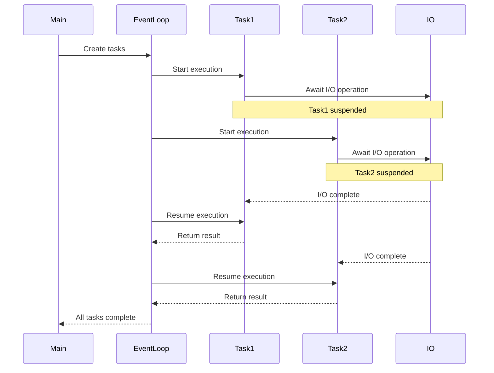

## Why Async Python?

Python's asyncio enables writing concurrent code using the async/await syntax,
perfect for I/O-bound operations.

### Async/Await Execution Flow



## Basic Async Function

```python
import asyncio

async def greet(name):
    await asyncio.sleep(1)  # Simulate I/O operation
    return f"Hello, {name}!"

async def main():
    result = await greet("World")
    print(result)

# Run the async function
asyncio.run(main())
```

## Multiple Concurrent Tasks

```python
import asyncio
import time

async def fetch_data(id, delay):
    print(f"Fetching data {id}...")
    await asyncio.sleep(delay)
    return {'id': id, 'data': f'Data {id}'}

async def main():
    start_time = time.time()

    # Run tasks concurrently
    tasks = [
        fetch_data(1, 2),
        fetch_data(2, 1),
        fetch_data(3, 3),
    ]

    results = await asyncio.gather(*tasks)

    end_time = time.time()
    print(f"Results: {results}")
    print(f"Total time: {end_time - start_time:.2f} seconds")

asyncio.run(main())
```

## Async Context Managers

```python
import asyncio

class AsyncDatabase:
    async def __aenter__(self):
        print("Connecting to database...")
        await asyncio.sleep(1)
        print("Connected!")
        return self

    async def __aexit__(self, exc_type, exc_val, exc_tb):
        print("Closing database connection...")
        await asyncio.sleep(0.5)
        print("Connection closed!")

    async def query(self, sql):
        print(f"Executing: {sql}")
        await asyncio.sleep(0.5)
        return [{"id": 1, "name": "John"}]

async def main():
    async with AsyncDatabase() as db:
        results = await db.query("SELECT * FROM users")
        print(f"Query results: {results}")

asyncio.run(main())
```

## Async Generators

```python
import asyncio

async def async_range(count):
    for i in range(count):
        await asyncio.sleep(0.1)
        yield i

async def main():
    async for number in async_range(5):
        print(f"Got number: {number}")

asyncio.run(main())
```

## Error Handling in Async Code

```python
import asyncio

async def risky_operation(should_fail=False):
    await asyncio.sleep(1)
    if should_fail:
        raise ValueError("Operation failed!")
    return "Success"

async def main():
    try:
        result = await risky_operation(should_fail=True)
        print(result)
    except ValueError as e:
        print(f"Caught error: {e}")

    # Using asyncio.gather with return_exceptions
    results = await asyncio.gather(
        risky_operation(False),
        risky_operation(True),
        return_exceptions=True
    )

    for i, result in enumerate(results):
        if isinstance(result, Exception):
            print(f"Task {i} failed: {result}")
        else:
            print(f"Task {i} succeeded: {result}")

asyncio.run(main())
```

## Conclusion

Asyncio is powerful for I/O-bound operations. Remember: async is not the
solution for CPU-bound tasks - use multiprocessing for those!
