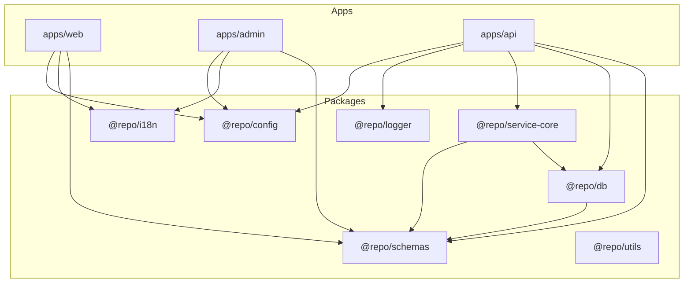
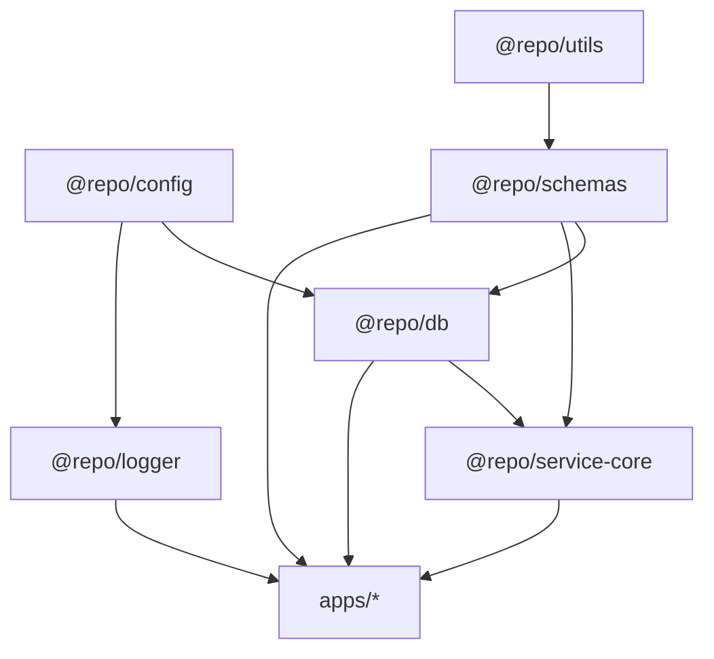

A monorepo doesn't make you professional. Having clear rules to keep it from
breaking does.

---

## From single repo to monorepo: the context

A single repo works perfectly while you have one app, little shared code, and
you can still understand the whole project with an `ls` and a coffee.

The problem appears when the project stops being a side project and becomes
something more like a product: public web, admin panel, API, shared schemas,
validations, business logic, and reusable UI. At that point, continuing to stuff
everything in the same `src` folder is asking the future to hate you.

That's where a monorepo with [Turborepo](https://turbo.build/repo) starts to
make sense.

---

## Overview of my monorepo

My monorepo is organized with a very simple idea: **apps/** for things end users
use, **packages/** for things the apps use. Nothing revolutionary, but the
difference is in being consistent.

### Apps: web, admin, api

In my case, the typical setup is:

- `apps/web` — Public site (Astro + React islands) with blog, landing pages, and
  marketing content
- `apps/admin` — Admin panel (TanStack Start + React) with internal management,
  dashboards, and backoffice
- `apps/api` — HTTP API (Hono) with data exposure, auth, and business logic

### Shared packages

Inside `packages/` lives everything I want to reuse in more than one app:

- `@repo/schemas` — Validations with Zod and inferred types via `z.infer<>`
- `@repo/db` — Drizzle schemas, models extending `BaseModel`, and data access
- `@repo/service-core` — Business logic, services extending `BaseCrudService`
- `@repo/config` — Centralized configuration and environment variable management
- `@repo/logger` — Consistent logging across apps
- `@repo/i18n` — Translations and internationalization helpers
- `@repo/utils` — Shared utilities
- `@repo/auth-ui` — UI components for authentication
- `@repo/icons` — Project icons
- `@repo/seed` — Seeds for development and testing

And some shared configuration packages:

- `@repo/typescript-config` — Base TypeScript configurations
- `@repo/biome-config` — Linting and formatting configuration with Biome
- `@repo/tailwind-config` — Shared Tailwind configuration

In tree form:

```txt
.
├─ apps/
│  ├─ web/          # Astro + React islands
│  ├─ admin/        # TanStack Start
│  └─ api/          # Hono
└─ packages/
   ├─ schemas/      # Zod schemas + inferred types
   ├─ db/           # Drizzle ORM + BaseModel
   ├─ service-core/ # BaseCrudService + business logic
   ├─ config/
   ├─ logger/
   ├─ i18n/
   ├─ utils/
   ├─ auth-ui/
   ├─ icons/
   ├─ seed/
   ├─ typescript-config/
   ├─ biome-config/
   └─ tailwind-config/
```

And in diagram form:



> [!tip] Mental rule: **apps consume packages, packages never consume apps.**

---

## What lives in apps/ and what lives in packages/

The key question of the monorepo isn't "how do I name it," but **where does each
thing go**.

**In apps/** goes:

- Code tied to a particular framework (Astro pages, TanStack Router routes, Hono
  handlers)
- Build entries (`main.tsx`, `main.ts`, `entry.server.ts`, etc.)
- Specific wiring (React providers only relevant to that app, specific layouts)

**In packages/** goes:

- Domain (business Zod schemas like `AccommodationSchema`, `DestinationSchema`,
  shared business rules)
- Reusable infrastructure (DB configuration without credentials, data access
  services, validations)
- Tools (logger, i18n, config, utils)

Practical rule: if you imagine you could someday use it in another app, it's
probably a `packages/` and not an `apps/`.

---

## Naming conventions, paths, and dependencies

If you don't define clear rules here, the monorepo becomes a spaghetti of
crossed imports.

### Naming conventions

I use a common scope for everything shared: `@repo/schemas`, `@repo/db`,
`@repo/service-core`, `@repo/config`, `@repo/logger`, etc.

Advantages: at a glance you know it comes from the monorepo, not from npm.
Cleaner autocomplete. Less magic with weird relative paths.

In a typical package's `package.json`:

```json
{
  "name": "@repo/schemas",
  "version": "0.0.0",
  "private": true,
  "type": "module",
  "main": "dist/index.js",
  "types": "dist/index.d.ts",
  "scripts": {
    "build": "tsup src/index.ts --format esm,cjs --dts",
    "test": "vitest run --passWithNoTests",
    "typecheck": "tsc --noEmit",
    "lint": "biome check ."
  },
  "dependencies": {
    "@repo/utils": "workspace:*",
    "@repo/config": "workspace:*",
    "zod": "^4.0.8"
  }
}
```

### Dependency rules

Golden rule: **layered dependencies**.

- **Core layer:** `@repo/config` and `@repo/utils`
- **Domain layer:** `@repo/schemas` (depends on utils), `@repo/db` (depends on
  schemas, config), `@repo/logger` (depends on config)
- **Services layer:** `@repo/service-core` (depends on db, schemas)



> [!warning] Rules I apply: **low-level** packages cannot depend on high-level
> packages. If I need something common, I lower the level and put it in a more
> generic package. Nothing in `packages/` depends on anything in `apps/`.

### Clean imports

In code, you get very readable imports:

```ts
import { AccommodationSchema, type Accommodation } from '@repo/schemas';
import { AccommodationModel } from '@repo/db';
import { AccommodationService } from '@repo/service-core';
```

Types are inferred from Zod schemas with `z.infer<>`, there's no separate types
package. Everything comes from `@repo/schemas`.

---

## How I use Turborepo: cache, tasks, and scripts

[Turborepo](https://turbo.build/repo) is what makes all this workable and not an
infinite pile of parallel scripts.

### Basic turbo.json structure

My actual `turbo.json`:

```json
{
  "$schema": "https://turborepo.com/schema.json",
  "ui": "tui",
  "globalDependencies": ["**/.env.*local"],
  "globalEnv": [
    "NODE_ENV",
    "CI",
    "HOSPEDA_DATABASE_URL",
    "HOSPEDA_API_URL",
    "HOSPEDA_SITE_URL"
  ],
  "tasks": {
    "build": {
      "dependsOn": ["^build"],
      "inputs": ["$TURBO_DEFAULT$", ".env*"],
      "outputs": ["dist/**"]
    },
    "lint": {
      "outputs": []
    },
    "dev": {
      "cache": false,
      "persistent": true
    },
    "typecheck": {
      "dependsOn": ["^typecheck"]
    },
    "test": {
      "dependsOn": ["build"],
      "outputs": [],
      "inputs": ["src/**/*.tsx", "src/**/*.ts", "test/**/*.ts"]
    },
    "test:coverage": {
      "dependsOn": ["build"],
      "outputs": ["coverage/**"]
    }
  },
  "concurrency": "20"
}
```

Human translation:

- `build` runs after the dependencies' `build` (`^build`) and caches results in
  `dist/`
- `lint` doesn't generate output files, so I don't cache outputs
- `test` depends on `build` and defines which files affect the cache
- `dev` runs without cache and with `persistent: true` because it runs
  indefinitely

### Scripts in the root

In the root `package.json`:

```json
{
  "scripts": {
    "dev": "turbo dev",
    "build": "turbo build",
    "lint": "turbo lint",
    "typecheck": "turbo typecheck",
    "test": "turbo test",
    "test:coverage": "turbo test:coverage"
  }
}
```

And in each app/package:

```json
{
  "scripts": {
    "dev": "astro dev",
    "build": "astro build",
    "lint": "biome check .",
    "typecheck": "tsc --noEmit",
    "test": "vitest run"
  }
}
```

Turborepo handles running each task where it belongs, reusing results from
previous builds (local and remote cache if you want), and respecting the
dependency graph. Practical result: `turbo build` doesn't recompile everything
from scratch every time.

---

## Benefits and trade-offs

There's no free lunch. A well-built monorepo brings many good things, but also
some complications.

### The good

- **Real reusability** of schemas, validations, business logic — everything
  shared without copy-paste
- **Coherence** with a single version of each thing: domain Zod schemas,
  services, data models
- **Strong DX** with a single `pnpm install`, global scripts, and Turborepo
  managing tasks
- **Coordinated changes** — You change a schema and see which apps break in the
  same place. You can refactor more safely because the compiler marks everything

### What makes it complicated

- **Heavier onboarding** — For someone new, understanding the monorepo takes
  more time than understanding an isolated repo
- **Discipline** — If you don't respect dependency rules, you end up with weird
  crossed imports, packages that depend on everything, and difficulty extracting
  parts
- **More sophisticated tooling** — Three root scripts aren't enough. You need to
  think through the `turbo.json`, align tsconfigs, and keep internal versions
  synchronized

### When NOT to use a monorepo

- **Small project, single app, no growth plans** — A simple repo is enough and
  saves you complexity
- **Teams with almost independent projects** with different release cycles,
  different stacks, and little shared logic — Sometimes several well-defined
  repos are healthier
- **If your team is still struggling with more basic things** like testing, CI,
  or code review — Adding a monorepo on top can add noise before adding value

---

## Checklist for your own monorepo

If you're thinking about building or restructuring a monorepo, I'd review this:

- You're clear on what apps will be in `apps/`
- You're clear on what will live in `packages/` and why
- You've defined a common scope (`@repo/*`) for your packages
- You have explicit dependency rules (what can depend on what)
- You have a `turbo.json` with tasks for: `build`, `lint`, `typecheck`, `test`,
  `dev`
- You know how types and schemas relate (Zod with `z.infer<>`? Separate
  package?)
- You have an internal README that explains all this for new people

If you check most of these, your monorepo is much closer to being a helpful tool
and not a source of chaos.

---

## Closing

My monorepo strategy with Turborepo isn't perfect or unique, but it has
something that's key for me: **it's maintainable**.

- Apps well separated by responsibility
- Shared packages that actually make sense to share
- Simple dependency rules
- Turborepo as orchestrator of builds, tests, and lint

If your project is no longer a toy and started looking like a product with
several pieces, taking the time to build a thoughtful monorepo can save you a
lot of future grief.

The idea isn't to complicate your life "because monorepo is trendy." The idea is
for the structure to support the project instead of slowing it down.

---

## References

- [Turborepo](https://turbo.build/repo) — The orchestrator I use to manage the
  monorepo
- [pnpm](https://pnpm.io/) — Package manager with native workspace support
- [Hospeda](/en/projects/hospeda) — My project where I apply this architecture
