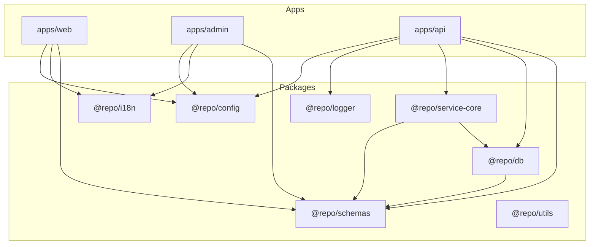
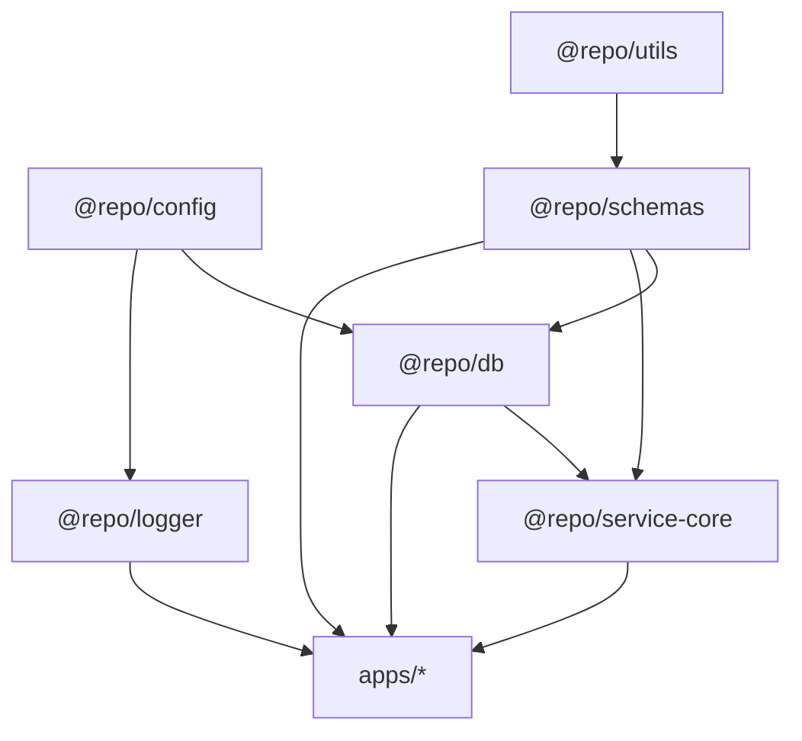

Un monorepo no te hace profesional. Tener reglas claras para no romperlo, sí.

---

## De repo único a monorepo: el contexto

Un repo funciona perfecto mientras tenés una sola app, poco código compartido, y
todavía podés entender todo el proyecto con un `ls` y un café.

El problema aparece cuando el proyecto deja de ser un _side project_ y pasa a
ser algo más parecido a un producto: web pública, panel admin, API, _schemas_
compartidos, validaciones, lógica de negocio y UI reutilizable. En ese punto,
seguir metiendo todo en la misma carpeta `src` es pedirle al futuro que te odie.

Ahí es donde un _monorepo_ con [Turborepo](https://turbo.build/repo) empieza a
tener sentido.

---

## Visión general de mi monorepo

Mi _monorepo_ se organiza con una idea muy simple: **apps/** para cosas que los
usuarios finales usan, **packages/** para cosas que las apps usan. Nada
revolucionario, pero la diferencia está en ser consistente.

### Apps: web, admin, api

En mi caso, lo típico es:

- `apps/web` — Sitio público (Astro + React _islands_) con blog, _landing_ y
  páginas de marketing
- `apps/admin` — Panel admin (TanStack Start + React) con gestión interna,
  _dashboards_ y _backoffice_
- `apps/api` — API HTTP (Hono) con exposición de datos, _auth_ y lógica de
  negocio

### Packages compartidos

Dentro de `packages/` vive todo lo que quiero reutilizar en más de una app:

- `@repo/schemas` — Validaciones con Zod y tipos inferidos via `z.infer<>`
- `@repo/db` — Drizzle _schemas_, _models_ que extienden `BaseModel`, y acceso a
  datos
- `@repo/service-core` — Lógica de negocio, _services_ que extienden
  `BaseCrudService`
- `@repo/config` — Manejo centralizado de configuración y variables de entorno
- `@repo/logger` — _Logging_ consistente entre apps
- `@repo/i18n` — Traducciones y _helpers_ de internacionalización
- `@repo/utils` — Utilidades compartidas
- `@repo/auth-ui` — Componentes de UI para autenticación
- `@repo/icons` — Iconos del proyecto
- `@repo/seed` — _Seeds_ para desarrollo y _testing_

Y algunos _packages_ de configuración compartida:

- `@repo/typescript-config` — Configuraciones base de TypeScript
- `@repo/biome-config` — Configuración de _linting_ y _formatting_ con Biome
- `@repo/tailwind-config` — Configuración compartida de Tailwind

En forma de árbol:

```txt
.
├─ apps/
│  ├─ web/          # Astro + React islands
│  ├─ admin/        # TanStack Start
│  └─ api/          # Hono
└─ packages/
   ├─ schemas/      # Zod schemas + tipos inferidos
   ├─ db/           # Drizzle ORM + BaseModel
   ├─ service-core/ # BaseCrudService + lógica de negocio
   ├─ config/
   ├─ logger/
   ├─ i18n/
   ├─ utils/
   ├─ auth-ui/
   ├─ icons/
   ├─ seed/
   ├─ typescript-config/
   ├─ biome-config/
   └─ tailwind-config/
```

Y en diagrama:



> [!tip] Regla mental: **las apps consumen packages, los packages nunca consumen
> apps.**

---

## Qué vive en apps/ y qué vive en packages/

La pregunta clave del _monorepo_ no es "cómo lo nombro", sino **dónde va cada
cosa**.

**En apps/** va:

- Código pegado a un _framework_ particular (páginas de Astro, rutas de TanStack
  Router, _handlers_ de Hono)
- Entradas de _build_ (`main.tsx`, `main.ts`, `entry.server.ts`, etc.)
- _Wiring_ específico (_providers_ de React solo relevantes para esa app,
  _layouts_ específicos)

**En packages/** va:

- Dominio (_schemas_ Zod de negocio como `AccommodationSchema`,
  `DestinationSchema`, reglas de negocio compartidas)
- Infraestructura reutilizable (configuración de DB sin credenciales, _services_
  de acceso a datos, validaciones)
- Herramientas (_logger_, _i18n_, _config_, _utils_)

Regla práctica: si imaginás que algún día podrías usarlo en otra app,
probablemente sea un `packages/` y no un `apps/`.

---

## Convenciones de nombres, paths y dependencias

Si no definís reglas claras acá, el _monorepo_ se te transforma en un
_spaghetti_ de _imports_ cruzados.

### Convenciones de nombres

Uso un _scope_ común para todo lo compartido: `@repo/schemas`, `@repo/db`,
`@repo/service-core`, `@repo/config`, `@repo/logger`, etc.

Ventajas: a simple vista sabés que eso viene del _monorepo_, no de npm.
Autocompletado más limpio. Menos magia de _paths_ relativos raros.

En el `package.json` de un _package_ típico:

```json
{
  "name": "@repo/schemas",
  "version": "0.0.0",
  "private": true,
  "type": "module",
  "main": "dist/index.js",
  "types": "dist/index.d.ts",
  "scripts": {
    "build": "tsup src/index.ts --format esm,cjs --dts",
    "test": "vitest run --passWithNoTests",
    "typecheck": "tsc --noEmit",
    "lint": "biome check ."
  },
  "dependencies": {
    "@repo/utils": "workspace:*",
    "@repo/config": "workspace:*",
    "zod": "^4.0.8"
  }
}
```

### Reglas de dependencias

Regla de oro: **dependencias en capas**.

- **Capa núcleo:** `@repo/config` y `@repo/utils`
- **Capa dominio:** `@repo/schemas` (depende de utils), `@repo/db` (depende de
  schemas, config), `@repo/logger` (depende de config)
- **Capa servicios:** `@repo/service-core` (depende de db, schemas)



> [!warning] Reglas que aplico: _packages_ de **nivel bajo** no pueden depender
> de _packages_ de nivel alto. Si necesito algo común, lo bajo de nivel y lo
> pongo en un _package_ más genérico. Nada en `packages/` depende de algo en
> `apps/`.

### Imports limpios

En código, quedan _imports_ muy legibles:

```ts
import { AccommodationSchema, type Accommodation } from '@repo/schemas';
import { AccommodationModel } from '@repo/db';
import { AccommodationService } from '@repo/service-core';
```

Los tipos se infieren de los Zod _schemas_ con `z.infer<>`, no hay un _package_
separado de tipos. Todo sale de `@repo/schemas`.

---

## Cómo uso Turborepo: cache, tasks y scripts

[Turborepo](https://turbo.build/repo) es el que se encarga de que todo esto sea
trabajable y no una pila infinita de _scripts_ en paralelo.

### Estructura básica de turbo.json

Mi `turbo.json` real:

```json
{
  "$schema": "https://turborepo.com/schema.json",
  "ui": "tui",
  "globalDependencies": ["**/.env.*local"],
  "globalEnv": [
    "NODE_ENV",
    "CI",
    "HOSPEDA_DATABASE_URL",
    "HOSPEDA_API_URL",
    "HOSPEDA_SITE_URL"
  ],
  "tasks": {
    "build": {
      "dependsOn": ["^build"],
      "inputs": ["$TURBO_DEFAULT$", ".env*"],
      "outputs": ["dist/**"]
    },
    "lint": {
      "outputs": []
    },
    "dev": {
      "cache": false,
      "persistent": true
    },
    "typecheck": {
      "dependsOn": ["^typecheck"]
    },
    "test": {
      "dependsOn": ["build"],
      "outputs": [],
      "inputs": ["src/**/*.tsx", "src/**/*.ts", "test/**/*.ts"]
    },
    "test:coverage": {
      "dependsOn": ["build"],
      "outputs": ["coverage/**"]
    }
  },
  "concurrency": "20"
}
```

Traducción humana:

- `build` se ejecuta después del `build` de las dependencias (`^build`) y cachea
  resultados en `dist/`
- `lint` no genera archivos de salida, así que no cacheo _outputs_
- `test` depende de `build` y define qué archivos afectan el cache
- `dev` va sin cache y con `persistent: true` porque corre indefinidamente

### Scripts en el root

En `package.json` de la raíz:

```json
{
  "scripts": {
    "dev": "turbo dev",
    "build": "turbo build",
    "lint": "turbo lint",
    "typecheck": "turbo typecheck",
    "test": "turbo test",
    "test:coverage": "turbo test:coverage"
  }
}
```

Y en cada app/package:

```json
{
  "scripts": {
    "dev": "astro dev",
    "build": "astro build",
    "lint": "biome check .",
    "typecheck": "tsc --noEmit",
    "test": "vitest run"
  }
}
```

Turborepo se encarga de ejecutar cada _task_ donde corresponde, reusar
resultados de _builds_ previos (cache local y remoto si querés), y respetar el
grafo de dependencias. Resultado práctico: `turbo build` no recompila todo desde
cero cada vez.

---

## Beneficios y trade-offs

No hay almuerzo gratis. Un _monorepo_ bien armado trae muchas cosas buenas, pero
también algunas complicaciones.

### Lo bueno

- **Reutilización real** de _schemas_, validaciones, lógica de negocio — todo
  compartido sin copiar y pegar
- **Coherencia** con una sola versión de cada cosa: _schemas_ Zod de dominio,
  _services_, modelos de datos
- **DX fuerte** con un solo `pnpm install`, _scripts_ globales, y Turborepo
  manejando _tasks_
- **Cambios coordinados** — Cambiás un _schema_ y ves qué apps se rompen en el
  mismo lugar. Podés refactorizar de forma más segura porque el compilador te
  marca todo

### Lo que complica

- **Onboarding más pesado** — Para alguien nuevo, entender el _monorepo_ lleva
  más tiempo que entender un repo aislado
- **Disciplina** — Si no respetás las reglas de dependencias, terminás con
  _imports_ cruzados raros, paquetes que dependen de todo, y dificultad para
  extraer partes
- **Tooling más sofisticado** — No alcanza con tres _scripts_ en el root. Hay
  que pensar bien el `turbo.json`, alinear _tsconfigs_, y mantener versiones
  internas sincronizadas

### Cuándo NO usar un monorepo

- **Proyecto chico, una sola app, sin planes de crecer** — Un repo simple te
  alcanza y te ahorra complejidad
- **Equipos con proyectos casi independientes** con diferentes ciclos de
  _release_, diferentes _stacks_, y poca lógica compartida — A veces varios
  repos bien definidos son más sanos
- **Si tu equipo todavía está luchando con cosas más básicas** como _testing_,
  CI, o _code review_ — Meter un _monorepo_ encima puede sumar ruido antes de
  sumar valor

---

## Checklist para tu propio monorepo

Si estás pensando en armar o reestructurar un _monorepo_, yo revisaría esto:

- Tenés claro qué apps va a haber en `apps/`
- Tenés claro qué va a vivir en `packages/` y por qué
- Definiste un _scope_ común (`@repo/*`) para tus _packages_
- Tenés reglas explícitas de dependencias (qué puede depender de qué)
- Tenés un `turbo.json` con _tasks_ para: `build`, `lint`, `typecheck`, `test`,
  `dev`
- Sabés cómo se relacionan los tipos y _schemas_ (¿Zod con `z.infer<>`?
  ¿_Package_ separado?)
- Tenés un README interno que explique todo esto para gente nueva

Si marcás la mayoría de estas, tu _monorepo_ está mucho más cerca de ser una
herramienta a favor y no una fuente de caos.

---

## Cierre

Mi estrategia de _monorepo_ con Turborepo no es perfecta ni única, pero tiene
algo que para mí es clave: **es mantenible**.

- Apps bien separadas por responsabilidad
- _Packages_ compartidos que realmente tienen sentido compartir
- Reglas simples de dependencias
- Turborepo como orquestador de _builds_, tests y _lint_

Si tu proyecto ya no es un juguete y empezó a parecerse a un producto con varias
piezas, tomarte el tiempo de armar un _monorepo_ con cabeza puede ahorrarte
muchos disgustos a futuro.

La idea no es complicarse la vida "porque _monorepo_ está de moda". La idea es
que la estructura acompañe al proyecto en lugar de frenarlo.

---

## Referencias

- [Turborepo](https://turbo.build/repo) — El orquestador que uso para manejar el
  _monorepo_
- [pnpm](https://pnpm.io/) — Package manager con soporte nativo de _workspaces_
- [Hospeda](/es/projects/hospeda) — Mi proyecto donde aplico esta arquitectura
